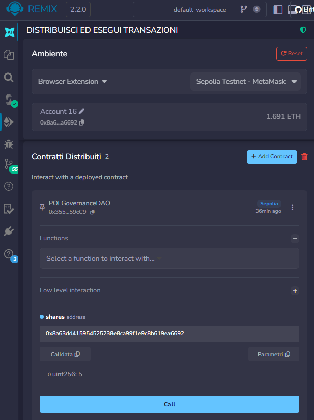
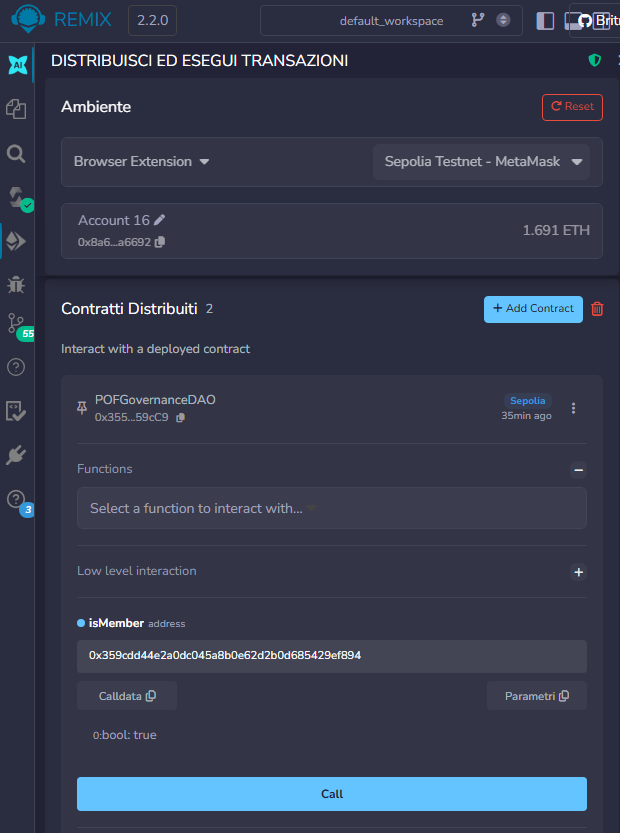
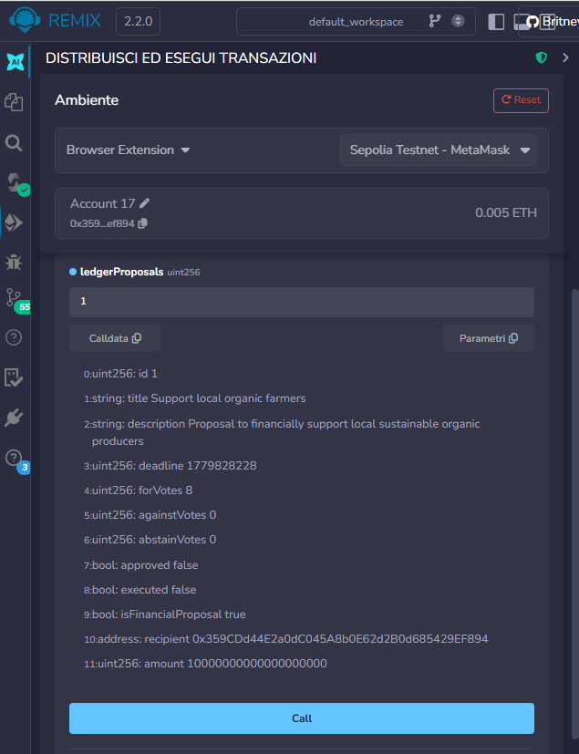

# Planty of Food DAO

Planty of Food DAO è un sistema di governance decentralizzata sviluppato per **Planty of Food**, un’azienda green focalizzata sulla diffusione di un’alimentazione plant-based sostenibile attraverso prodotti provenienti esclusivamente da produttori italiani, etici e biologici.

Il progetto implementa una DAO (Decentralized Autonomous Organization) che permette ai membri della community di partecipare attivamente alle decisioni aziendali tramite meccanismi di voto decentralizzato.

---

# Panoramica progetto e obiettivi

Planty of Food considera la community un elemento fondamentale per il raggiungimento dei propri obiettivi di sostenibilità.  
Per questo motivo, l’azienda ha deciso di adottare un modello di governance decentralizzato che consenta agli utenti di partecipare direttamente ai processi decisionali.

La DAO permette agli utenti di acquistare shares di governance POF (ERC-20) e diventare membri della DAO. I membri potranno:

- creare "governance proposal" e "financial proposal"
- votare tramite un sistema di weighted voting
- delegare il proprio potere di voto ad altri membri della DAO
- eseguire proposal approvate on-chain
- gestire i fondi della Treasury tramite decisioni condivise

Il progetto è stato sviluppato con l’obiettivo di simulare una governance decentralizzata semplice, sicura e trasparente, rafforzando allo stesso tempo le competenze pratiche nell’utilizzo di Solidity, Hardhat, OpenZeppelin, TypeScript ed Ethers.js.

---

# Governance Model

Il sistema di governance implementato combina elementi di:

- **Democrazia diretta**, dove ogni membro può votare direttamente
- **Democrazia liquida**, in cui un membro può delegare il proprio potere di voto a un altro membro della DAO

Il peso del voto è basato sul numero di shares possedute dal membro (`weighted voting`).  
Ogni membro può delegare il proprio voting power a un altro membro della DAO, perdendo il diritto di voto diretto e consentendo una gestione più flessibile della governance.

I membri possono votare `FOR`, `AGAINST` oppure `ABSTAIN` per una proposal.  
Le proposal vengono considerate approvate **solamente** quando i voti `FOR` risultano superiori ai voti `AGAINST`; in caso di parità, la proposal verrà automaticamente respinta.

---

# Architettura progetto

Il progetto è composto da tre smart contract principali:

### POFToken.sol

Contratto ERC-20 sviluppato tramite OpenZeppelin che rappresenta il token di governance della DAO (`POF`).

Responsabilità principali:

- gestione del token ERC-20
- distribuzione della supply iniziale
- possibilità per l'owner di effettuare mint controllati per la distribuzione dei token ai membri della DAO

### POFTreasury.sol

Contratto responsabile della gestione dei fondi della DAO, progettato per custodire i token POF e consentire trasferimenti solamente dopo l’approvazione di una financial proposal.

Responsabilità principali:

- custodire i token POF
- autorizzare trasferimenti solamente tramite il contratto GovernanceDAO

### POFGovernanceDAO.sol

Contratto principale della DAO che gestisce l’intero sistema di governance, il cuore pulsante del progetto.

Responsabilità principali:

- acquisto shares e membership DAO
- creazione di governance proposal e financial proposal
- gestione weighted voting con sistemi di liquid democracy e delegated voting
- registrazione on-chain di proposal, votazioni e decisioni della DAO
- esecuzione proposal approvate on-chain
- possibilità per l’owner di terminare la fase iniziale di vendita shares della DAO

---

# Scelte tecniche

Durante lo sviluppo del progetto sono state effettuate diverse scelte tecniche con l’obiettivo di avere un flusso leggibile e facilmente estendibile.

### Utilizzo di OpenZeppelin

Per lo sviluppo degli smart contract ERC-20 e della gestione ownership sono state utilizzate le librerie OpenZeppelin, in particolare `ERC20`, `Ownable`, `IERC20`.

### Weighted Voting

Il sistema di voto implementato utilizza un modello di `weighted voting`, in cui il peso del voto dipende dal numero di shares possedute dal membro della DAO.

### Separazione tra Governance Proposal e Financial Proposal

Durante la progettazione della DAO si è scelto di separare le proposal in due categorie:

- `Governance Proposal`
- `Financial Proposal`

  Questa scelta ha permesso di mantenere più semplice e leggibile la gestione della governance, separando le decisioni puramente organizzative dalle proposal che richiedono trasferimenti di fondi dalla Treasury.

Inoltre, questa architettura ha reso più chiara l’implementazione della funzione `executeProposal`.

### Liquid Democracy

La DAO implementa anche un sistema di `delegated voting`, in cui un membro può delegare il proprio voting power ad un altro membro della DAO, rinunciando temporaneamente al proprio diritto di voto diretto.

### Governance Ledger

Le proposal e le votazioni vengono registrate on-chain tramite apposite strutture dati (`mapping` e `struct`), creando un vero e proprio registro decentralizzato delle decisioni della DAO.

---

# Security Choices

Durante lo sviluppo sono state implementate diverse protezioni per aumentare la sicurezza e l’affidabilità del sistema.

Misure implementate:

- controllo accessi tramite `onlyOwner` e `onlyMember`
- protezione contro il double voting
- prevenzione delle deleghe circolari (`circular delegation`)
- validazione proposal e voting deadline
- verifica dei fondi disponibili della Treasury prima della creazione delle financial proposal
- controllo indirizzi `address(0)`
- gestione separata Treasury / GovernanceDAO
- validazione trasferimenti token ERC-20 tramite controllo boolean `success`
- utilizzo del pattern `checks-effects-interactions` nella funzione `executeProposal`

---

# Testing

Il progetto è stato testato tramite Hardhat e Mocha utilizzando test automatizzati sviluppati in TypeScript.

I test coprono i principali flussi della DAO:

- deploy corretto degli smart contract
- acquisto shares e membership DAO
- creazione governance e financial proposal
- weighted voting
- delegated voting e liquid democracy
- prevenzione delle deleghe circolari
- approvazione / rigetto proposal
- gestione voti `FOR`, `AGAINST`, `ABSTAIN`
- protezione contro il double voting
- controllo voting deadline
- controllo accessi `onlyMember`
- verifica fondi Treasury nelle financial proposal
- esecuzione financial proposal e trasferimento fondi Treasury

Per eseguire i test:

```bash
npx hardhat test
```

---

# Deploy Sepolia

Gli smart contract sono stati deployati sulla testnet Sepolia ai seguenti indirizzi:

### POFToken

`0xB6e2A924F20A049C1853aD6212449D253C5b61B7`

### POFTreasury

`0x0Af25aC1870A2A7365aa9025Bd122b768bb8F54e`

### POFGovernanceDAO

`0xE4Fe762514f72DB17189C0069c1b45f28D1aFa1C`

### Etherscan

https://sepolia.etherscan.io/address/0xE4Fe762514f72DB17189C0069c1b45f28D1aFa1C

---

# Installazione ed Esecuzione

### Installazione dipendenze

```bash
npm install
```

### Compilazione smart contract

```bash
npx hardhat compile
```

### Esecuzione test

```bash
npx hardhat test
```

### Deploy locale

```bash
npx hardhat run scripts/deploy.ts
```

### Deploy Sepolia

```bash
npx hardhat run scripts/deploy.ts --network sepolia
```

---

# Screenshots & Demo DAO

### DAO Membership

Acquisto shares DAO e verifica membership on-chain.





---

### Governance Ledger

Financial proposal registrata nel ledger decentralizzato della DAO con sistema di weighted voting prima del trasferimento token.



---

### Hardhat Testing & Sepolia Deploy

Test automatici Hardhat e deploy reale su testnet Sepolia.


## 

---

# Conclusioni

Planty of Food DAO è un progetto realizzato durante il Master in Blockchain Development & AI per il corso Smart Contract con Solidity.

Questo progetto mi ha permesso di approfondire concetti che inizialmente apparivano semplici nella teoria ma fondamentali nella pratica, costruendo passo dopo passo una vera e propria DAO e simulando dinamiche realistiche di partecipazione e gestione condivisa.

Ogni componente del sistema è stato sviluppato per funzionare in sinergia con gli altri: dagli smart contract Solidity, ai test automatizzati con Hardhat, fino alla simulazione reale della DAO tramite Remix e Sepolia testnet.

---

# Autore

Sviluppato da **Giorgia Nieli**

Email  
giorgianieli@gmail.com

LinkedIn  
https://www.linkedin.com/in/giorgia-nieli-98b0882b0/
